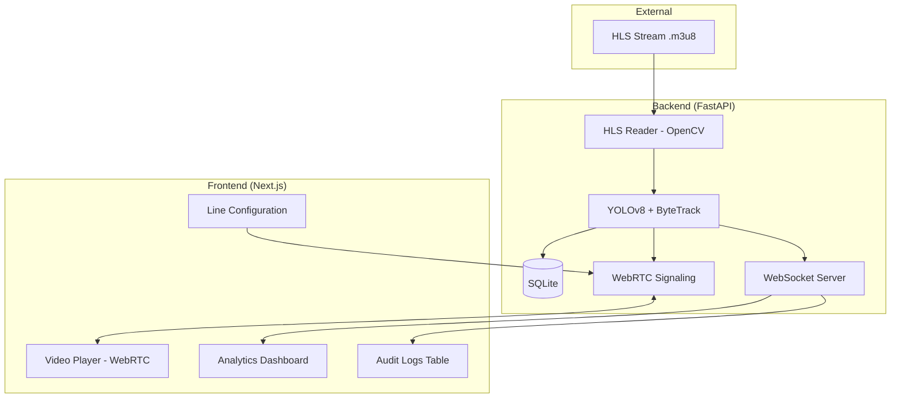

# Smart Traffic CCTV

A real-time vehicle counting system that ingests a live CCTV HLS stream, detects and tracks vehicles, counts crossings over a virtual line, and displays the results in a modern web dashboard.

## Architecture



## How to Run

### Method A: Running with Docker (Recommended)

Ensure you have Docker and Docker Compose installed.

1.  **Clone the repository**
2.  **Configure environment variables**: Add your HLS stream URL to the `docker-compose.yml` or a `.env` file.
3.  **Start the system**:
    ```bash
    docker-compose up --build
    ```
4.  **Access the Dashboard**: Open `http://localhost:3000`.

### Method B: Manual Development Setup

#### Prerequisites
* Node.js and `pnpm` installed.
* Python 3.11+ and `uv` installed.

#### 1. Start the Backend (FastAPI)
```bash
cd backend
uv run uvicorn app.main:app --reload --port 8000
```

#### 2. Start the Frontend (Next.js)
```bash
cd frontend
pnpm install
pnpm dev --port 3000
```

---
**Status**: Phase 8 - Production Readiness & Optimization complete. (Dockerization, Audit Logs, and Performance Tuning).
